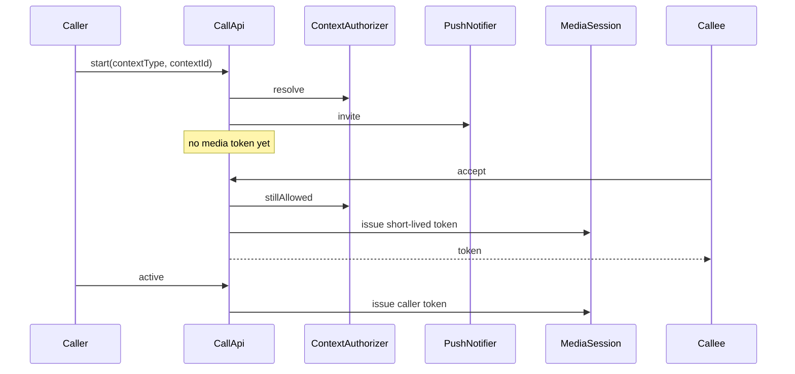

# Architecture

Context Call Control is a call **control plane**. A media server (LiveKit in the local example) transports audio. It does not decide who may talk.



## Errors

Domain code throws `ContextAccessError` and `ParticipantBusyError`. HTTP adapters throw `ApiError`. Neither type knows about product tables. `HttpErrorFilter` turns both into `{ statusCode, code, message }`. Unexpected exceptions become `INTERNAL` with a fixed sentence, so a client never receives a stack trace or a driver message.

## Ports

### Identity

`AuthUser` is `{ userId, displayName }`. The example guard verifies an HMAC JWT (`sub`, `name`) signed with `DEV_JWT_SECRET`. Production deployments replace the guard. The rest of the service only sees `AuthUser`.

### ContextAuthorizer

```ts
resolve(userId, contextType, contextId) => CallParties
stillAllowed(contextType, contextId) => boolean
```

`resolve` returns the caller, the callee, and both display names. It fails when the context does not exist, is inactive, or the user is not a participant.

`stillAllowed` is used when accepting a call and by the reaper. The example stores this in `call_contexts`. Your adapter can call another service. It must not require this process to know your product tables.

### PushNotifier

```ts
sendInvite(invite) => number
sendTerminal(userId, callId, reason) => void
```

`sendInvite` returns how many device endpoints were notified. `0` fails the ringing call with `callee_unreachable`. A thrown error fails it with `invite_delivery_failed`. The example logger reads active rows from `device_endpoints` and writes the payload to the log. It does not talk to a push vendor.

Device registration stores `client_kind`, `platform`, `push_provider`, a push token, and an optional VoIP token. Those fields are inputs to your notifier. They are not part of the call state machine.

### MediaSession

```ts
issueToken(roomName, userId, displayName) => string
closeRoom(roomName) => void
serverUrl() => string
```

Tokens last `CALL_TOKEN_TTL_SECONDS` (an integer from 10 to 120). Clients refresh them through `GET /v1/calls/active`. Room names are `call-{callId}`. Closing a room is best-effort: the database transition stays authoritative if the media server is down.

### MediaWebhookVerifier

Verifies the raw body and authorization header, then returns a normalized event: `participant_joined` or `participant_left`, plus room name, participant id, and participant count. Unknown events are ignored.

Joining a room never answers a `ringing` call. Only an answered call can move to `connecting` or `active`.

### CallStore

Persistence for sessions and the append-only event log. `SqlCallStore` is used at runtime. Tests use `MemoryCallStore`. Creating a ringing call locks both participant ids, replays an idempotency key, and rejects the insert when either participant already has a live call.

## Call states

Live: `ringing`, `answered`, `connecting`, `active`.

Terminal: `declined`, `missed`, `cancelled`, `ended`, `failed`.

| From | To | Who |
| --- | --- | --- |
| | `ringing` | Caller, after authorization |
| `ringing` | `failed` | Invite could not be delivered |
| `ringing` | `declined` | Callee |
| `ringing` | `cancelled` | Caller |
| `ringing` | `missed` | Ring deadline |
| `ringing`, `answered`, `connecting`, `active` | `ended` | Either participant, a disconnect, or a context that is no longer allowed |
| `answered`, `connecting` | `connecting` | First participant joined |
| `answered`, `connecting`, `active` | `active` | Second participant joined |

The caller receives a media token only when `answered_at` is set. The callee receives one from accept.

## Data

`migrations/001_call_control.sql` creates:

- `call_contexts` — example authorizer rows
- `call_sessions` — one row per call, opaque `context_type` and `context_id`
- `call_events` — transitions
- `device_endpoints` — push targets

Participant ids are strings. There is no foreign key to an external user table.

## Process layout

```text
src/ports/            Interfaces
src/auth/             Dev JWT guard
src/contexts/         Example authorizer and the dev seed route
src/calls/            State machine, SQL store, HTTP API, reaper
src/devices/          Endpoint registration
src/push/             Log notifier
src/media/            LiveKit token, room close, webhook verify
src/database/         Pool and migration runner
```
